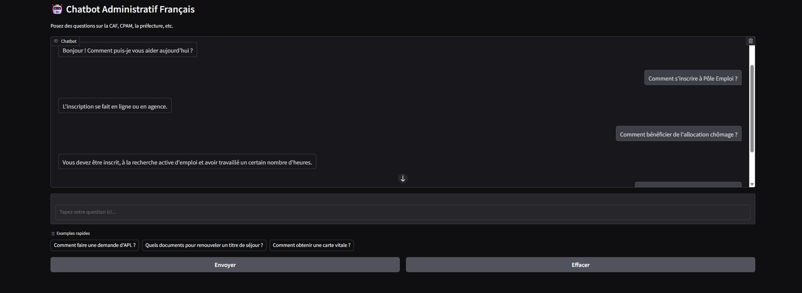

# French Administrative FAQ Chatbot with LoRA-tuned Mistral-7B

## Overview

This project delivers a bilingual AI assistant tailored to answer French administrative questions using a hybrid approach that combines:

- **Semantic FAQ retrieval** via multilingual sentence embeddings  
- **Natural language generation** using a fine-tuned Mistral-7B-Instruct model with LoRA adapters

### Capabilities

1. Recognize and reply to predefined FAQs with high accuracy  
2. Handle rephrased or semantically similar queries using cosine similarity  
3. Fall back to generative answers via a LoRA-tuned language model  
4. Detect and respond to small-talk or greetings

## Technical Stack

- **Base Model**: Mistral-7B-Instruct-v0.1  
- **Fine-Tuning**: LoRA (Low-Rank Adaptation)  
- **Retrieval**: Sentence Transformers (`distiluse-base-multilingual-cased-v1`)  
- **Generation**: Transformers with CPU/GPU fallback  
- **Quantization**: 4-bit inference via `bitsandbytes` (GPU only)  
- **Fallback**: Full FP32 CPU inference for low-resource machines

## Features

- ✅ GPU & CPU support with auto-detection  
- ✅ Efficient 4-bit quantized generation on GPU  
- ✅ Fully localized for French administrative content  
- ✅ Modular codebase: `core.py`, `faq.json`, adapter folders  
- ✅ Easily extensible and production-ready

## Use Cases

- Public service virtual agents (CAF, CPAM, URSSAF)  
- Local government helpdesks  
- Fine-tuning pipelines (LoRA/QLoRA)  
- French NLP/NLU experimentation


## 🖼️ Demo



> 💡 Add a screenshot or GIF of your Gradio interface here.


---

## 🗂️ Repository Structure

```
fr-admin-chatbot/
├── app.py             # Gradio-based UI
├── core.py            # Semantic search logic + LLM fallback
├── data/              # Contains precomputed embeddings and source FAQs
├── models/            # Optional fallback LLM model directory
├── requirements.txt   # Required dependencies
└── README.md
```

---

##  How to Run

1. **Install dependencies**

   ```bash
   pip install -r requirements.txt
   ```

2. **(Optional) Use a virtual environment**

   ```bash
   python -m venv venv
   source venv/bin/activate  # Windows: venv\Scripts\activate
   ```

3. **Start the chatbot UI**

   ```bash
   python main.py
   ```


---

## 🔍 How It Works

1. User inputs a question in French.
2. The system computes the semantic similarity to a curated FAQ dataset using `sentence-transformers`.
3. If a high-confidence match is found, the corresponding answer is returned.
4. If not, the system forwards the query to the fallback LLM (fine-tuned on administrative data) to generate a response.

---

## 🧠 Fallback Model

This project integrates the custom fine-tuned LLM from [`fr-admin-llm`](https://github.com/kamiyarnazari/fr-admin-llm) when retrieval fails. You can also swap it for any Hugging Face-compatible model.

---

## 📎 Notes

- The FAQ data is based on official French administrative sources.
- Embeddings are precomputed for faster runtime response.
- You can plug in your own dataset or fallback model via `core.py`.

---


